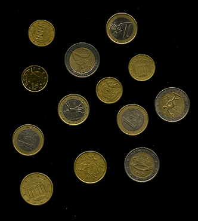
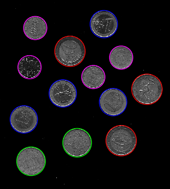

# Coin Detection Hough Transformation
 
### Detect the type of coins from an image(.tif) using Hough Transformation.

## *Instructions*
#### Choose an image pressing any number from *2* to *8* (7 is not available).

### Image 'coins002'  
#### Preview  
  
  
#### After Hough Transformation  
  

##### Code runs on Python 3.6 x64 bit.
